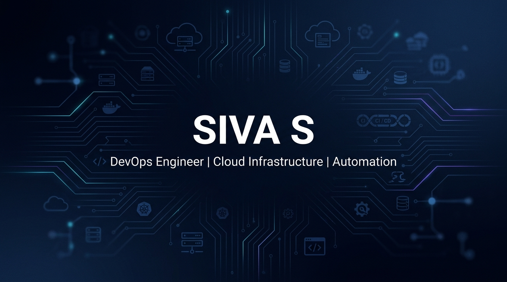

<!-- ========================================== -->
<!-- 🚀 GITHUB PROFILE README — Siva S         -->
<!-- ========================================== -->

<!-- BANNER -->

 

<!-- ANIMATED TYPING -->

 

<!-- PROFILE VIEWS -->

  

<!-- SOCIAL BADGES -->

&nbsp;

&nbsp;

<!-- 
  ╔══════════════════════════════════════════════════════════════╗
  ║  PLACEHOLDER: Add these badges when URLs are available      ║
  ║                                                              ║
  ║  LinkedIn:                                                   ║
  ║  <a href="YOUR_LINKEDIN_URL">                                ║
  ║                                             ║
  ║  </a>                                                        ║
  ║                                                              ║
  ║  LeetCode:                                                   ║
  ║  <a href="YOUR_LEETCODE_URL">                                ║
  ║                                             ║
  ║  </a>                                                        ║
  ║                                                              ║
  ║  Resume:                                                     ║
  ║  <a href="YOUR_RESUME_URL">                                  ║
  ║                                        ║
  ║  </a>                                                        ║
  ╚══════════════════════════════════════════════════════════════╝
-->

 

 

<!-- ==================== ABOUT ME ==================== -->

##  &nbsp;About Me

I'm **Siva S**, a Computer Science undergraduate at **Sriram Engineering College**, Tamil Nadu, graduating in **May 2026** with a focus on **DevOps, Cloud Infrastructure, and Automation**.

- 🔧 &nbsp;I specialize in **Infrastructure as Code** using Terraform, **CI/CD automation** with Jenkins, and **Docker-based deployments**
- ☁️ &nbsp;Experienced with **AWS (EC2, S3, Elastic Beanstalk)** and **Google Cloud Platform**
- 🐧 &nbsp;Proficient in **Linux administration** — Ubuntu server optimization, kernel tuning, EFI/GRUB management
- ⛓️ &nbsp;Hands-on experience with **Blockchain development** — Ethereum, Solidity, Hardhat, dApps
- 🤖 &nbsp;Background in **AI/Data Science** — ML classifiers, Explainable AI (SHAP/LIME), NLP
- 🌐 &nbsp;Full-stack capabilities with **React.js**, **Flask**, **Java**, and **MySQL**
- 🎓 &nbsp;B.E. Computer Science — **CGPA: 80%**
- 📍 &nbsp;Based in **Tiruvallur / Chennai, Tamil Nadu, India**

 

 

<!-- ==================== TECH STACK ==================== -->

##  &nbsp;Tech Stack

### 💻 Programming Languages

  

  

---

### 🌐 Frontend

  

---

### ⚙️ Backend

  

---

### 🗄️ Database

  

---

### ☁️ Cloud & DevOps

  

  
  
  
  
  
  

---

### 🐧 Operating Systems

  

  

---

### ⛓️ Blockchain

  

  
  
  

---

### 🤖 AI & Data Science

  
  
  
  

  
  
  
  

 

 

<!-- ==================== EXPERIENCE ==================== -->

##  &nbsp;Professional Experience

<b>🔧 DevOps Intern — Burj Tech Consultancy</b> &nbsp;|&nbsp; <i>Jan 2026 – Mar 2026 &nbsp;•&nbsp; Tiruvallur, India</i>

 

- Automated cloud infrastructure provisioning using **Terraform**
- Managed end-to-end **CI/CD pipelines** using **Jenkins**
- Utilized **Docker Compose** for multi-container orchestration
- Performed **Ubuntu kernel and server optimization**
- Conducted root-cause analysis for system failures and infrastructure issues

<b>🤖 Data Science & AI Intern — Rasa AI Labs</b> &nbsp;|&nbsp; <i>Jun 2025 – Jul 2025 &nbsp;•&nbsp; Chennai, India</i>

 

- Configured scalable deployment environments for real-time AI models with high availability
- Collaborated on infrastructure performance tuning for large-scale data processing workloads

<b>📊 Data Science Intern — Remark Skill Education (IIT Hyderabad)</b> &nbsp;|&nbsp; <i>Apr 2025 – May 2025 &nbsp;•&nbsp; Remote</i>

 

- Developed automated data extraction scripts using **Python**
- Improved preprocessing efficiency for analytical pipelines
- Built predictive ML classifiers using **Scikit-learn** to derive actionable business insights

 

 

<!-- ==================== PROJECTS ==================== -->

##  &nbsp;Featured Projects

<table>
<tr>

<td width="50%" valign="top">

### ⛓️ SmartPanchayat
**Blockchain Governance dApp**

  

A decentralized governance platform with React.js frontend and Java backend integration. Features Hardhat-based smart contract deployment and an immutable ledger on Ethereum for transparent fund tracking.

📅 *May 2026*

<!-- 🔗 [View Project](YOUR_SMARTPANCHAYAT_LINK) -->

</td>

<td width="50%" valign="top">

### 🤖 Genious Shoppy
**AI E-commerce Analytics**

  

Integrated Explainable AI using SHAP and LIME for transparent customer segmentation. Optimized pricing strategies and campaign triggers through automated Python backend services.

📅 *July 2025*

<!-- 🔗 [View Project](YOUR_GENIOUS_SHOPPY_LINK) -->

</td>

</tr>

<tr>

<td width="50%" valign="top">

### ☁️ Scalable E-Commerce Web App
**Cloud-Native Platform**

  

A secure e-commerce platform using Flask and MySQL optimized for high availability. Architected cloud storage using AWS S3 for efficient static asset and image management.

📅 *April 2025*

<!-- 🔗 [View Project](YOUR_ECOMMERCE_LINK) -->

</td>

<td width="50%" valign="top">

### 🌐 Portfolio Website

  

My personal developer portfolio showcasing projects, skills, and experience.

🔗 [Visit Portfolio](https://siva-doom-portfolio.vercel.app)

</td>

</tr>
</table>

 

 

<!-- ==================== EDUCATION ==================== -->

## 🎓 &nbsp;Education

| | |
|---|---|
| **🏛️ Institution** | Sriram Engineering College, Perumalpattu, Tamil Nadu |
| **📜 Degree** | Bachelor of Engineering (B.E.) |
| **💻 Department** | Computer Science |
| **📅 Graduation** | May 2026 |
| **📊 CGPA** | 80% |

 

 

<!-- ==================== GITHUB STATS ==================== -->

##  &nbsp;GitHub Analytics

&nbsp;&nbsp;

  

<!-- GITHUB STREAK -->

  

<!-- CONTRIBUTION GRAPH -->

 

 

<!-- ==================== TROPHIES ==================== -->

## 🏆 &nbsp;GitHub Trophies

 

 

<!-- ==================== SOFT SKILLS ==================== -->

## 🧠 &nbsp;Soft Skills

<table>
<tr>
<td align="center" width="25%">

**🎯 Leadership**

</td>
<td align="center" width="25%">

**🔍 Troubleshooting**

</td>
<td align="center" width="25%">

**🤝 Team Collaboration**

</td>
<td align="center" width="25%">

**💡 Critical Thinking**

</td>
</tr>
</table>

 

<!-- ==================== LANGUAGES ==================== -->

## 🗣️ &nbsp;Languages

| Language | Proficiency |
|----------|-------------|
| 🇬🇧 English | Professional |
| 🇮🇳 Tamil | Native |

 

 

<!-- ==================== CONNECT ==================== -->

##  &nbsp;Let's Connect

&nbsp;

&nbsp;

<!-- 
  ╔══════════════════════════════════════════════════════════╗
  ║  Add these when URLs are available:                      ║
  ║                                                          ║
  ║  <a href="YOUR_LINKEDIN_URL" target="_blank">            ║
  ║                                  ║
  ║  </a>                                                    ║
  ║                                                          ║
  ║  <a href="YOUR_LEETCODE_URL" target="_blank">            ║
  ║                                  ║
  ║  </a>                                                    ║
  ║                                                          ║
  ║  <a href="YOUR_RESUME_URL" target="_blank">              ║
  ║                                    ║
  ║  </a>                                                    ║
  ╚══════════════════════════════════════════════════════════╝
-->

  

<!-- ==================== SNAKE ANIMATION ==================== -->

  

<!--
  ╔══════════════════════════════════════════════════════════════╗
  ║  NOTE: To enable the snake animation above, you need to     ║
  ║  set up a GitHub Action in your profile repository.         ║
  ║                                                              ║
  ║  Create .github/workflows/snake.yml with the snake          ║
  ║  contribution graph action. If you don't want to set this   ║
  ║  up, the image will simply not render (no broken image).    ║
  ╚══════════════════════════════════════════════════════════════╝
-->